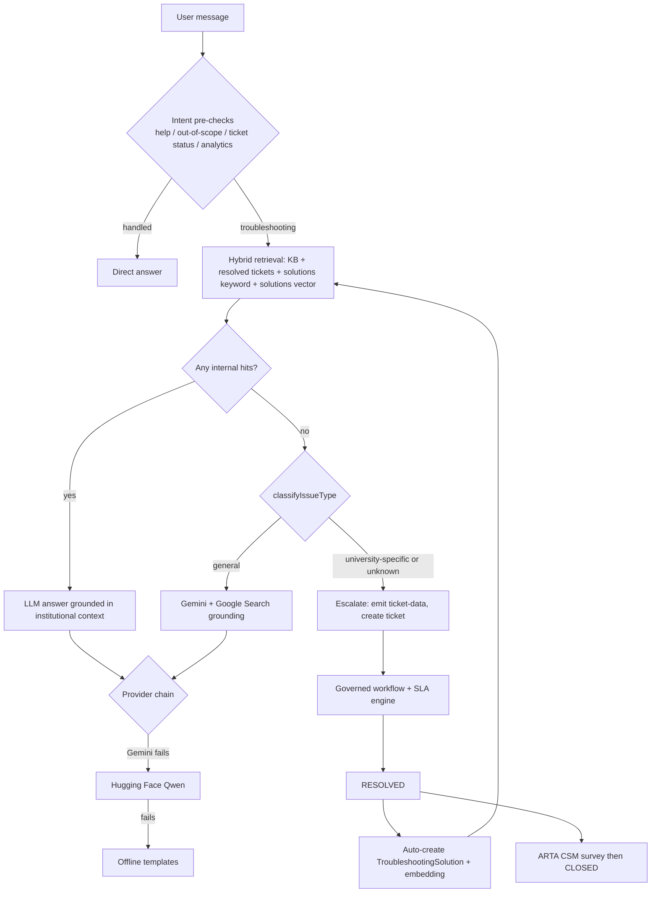

# PhD Research Brief — CHMSU Intelligent ICT Service Request Platform

> **READ THIS FIRST (instructions for any AI helping write the research paper)**
>
> This document tells you **what we are building, why it matters scientifically, and how the research should be framed** at a doctoral level. It is the *research-framing* layer. For deep technical specs, also read:
>
> | Document | Use it for |
> |---|---|
> | `PHD_RESEARCH_BRIEF.md` (this file) | Research problem, contributions, RQs, hypotheses, methodology, evaluation, limitations, writing rules |
> | `RESEARCH_SYSTEM_REFERENCE.md` | Full technical specification (architecture, schema, RAG pipeline, SLA, workflow, file map) |
> | `RESEARCH_PAPER.md` | The paper draft skeleton (chapters to fill in) |
> | `F.01-RDS-CHMSU-Design-and-Deve...` | The original institutional research proposal (CHMSU form F.01-RDS) |
> | `docs/AI_INTEGRATION_POINTS.md` | Research-objective-to-code mapping |
> | `docs/TESTING_QUESTIONNAIRES_MCCALL_PSSUQ.md`, `docs/UAT_TEST_CASES.md` | Evaluation instruments |
>
> **Project root**: `C:\Users\markm\Desktop\ai ict\ictsystem`
> **Facts in this brief were verified against the source code on 2026-10-05.** If code and documents disagree, **the code wins** — re-check before writing.

---

## 0. One-Paragraph Summary (use this to orient yourself)

We are building and evaluating a **web-based, AI-augmented IT Service Management (ITSM) platform** for the ICT Department of **Carlos Hilado Memorial State University (CHMSU)**, a Philippine State University (SUC). It replaces paper/walk-in service requests with a governed digital workflow (Requester → Secretary review → Director approval → MIS/ITS Head assignment → resolution → ARTA-compliant satisfaction survey), enforces **priority-based SLAs with automated two-tier escalation**, and adds a **conversational AI assistant** that answers users with **Retrieval-Augmented Generation (RAG) grounded in the institution's own resolved tickets and knowledge base**. Every resolved ticket is automatically converted into a vector-embedded problem–solution record, forming a **closed-loop, self-enriching institutional memory**. The AI layer is engineered for **resource-constrained public institutions**: it degrades gracefully (Gemini → Hugging Face → offline templates) and only consults the public web for *generic* IT problems, routing *institution-specific* unknowns directly to human-ticket creation.

---

## 1. Research Identity

| Item | Value |
|---|---|
| **Working title (current)** | *Design and Development of an Intelligent Service Request Monitoring and Analysis Platform with AI-Powered Troubleshooting and Predictive SLA Management for the Carlos Hilado Memorial State University ICT Department* |
| **Original proposal title (F.01)** | *Design and Development of an Intelligent Service Request Monitoring and Analysis Platform for ICT Department* |
| **Proponents (per F.01)** | Russel M. Dela Torre (College of Industrial Technology) and Mark Meguizo (ICT Department), CHMSU Main Campus, Talisay |
| **Focused agenda** | Digitalization, System Development |
| **Budget (F.01)** | ₱175,000.00 (CHMSU-funded) |
| **Research type** | Applied / developmental; recommended paradigm: **Design Science Research (DSR)** |
| **Context** | Philippine SUC; government agency subject to the Anti-Red Tape Authority (ARTA) |

### Suggested doctoral-level alternative titles (pick/adapt — do not use without author approval)
1. *Closing the Knowledge Loop in Public-Sector IT Service Management: A Design Science Study of a Provenance-Aware, Retrieval-Augmented Service Desk for a Philippine State University*
2. *Institutional-Knowledge-Grounded Conversational ITSM for Resource-Constrained Higher Education: Design, Implementation, and Multi-Method Evaluation*
3. *From Tickets to Tacit Knowledge: A Self-Enriching RAG Architecture with SLA Governance for ICT Service Delivery in Philippine SUCs*

> [!WARNING]
> The current title says **"Predictive SLA Management."** The code implements **rule-based, threshold SLA monitoring** (overdue / at-risk ≤ 4 h / on-track), **not** a statistical or ML predictive model. Either (a) rename to "Proactive" or "Automated SLA Management," or (b) add and evaluate an actual predictive model (e.g., resolution-time regression / breach classifier) before claiming "predictive." Do **not** describe it as predictive ML otherwise.

---

## 2. The Problem (Research Gap)

### 2.1 Practical problem (CHMSU)
- Service requests arrive via paper forms (see `its ticket.png`, `mis ticket.jpg` — the legacy paper forms), walk-ins, and informal channels.
- No centralized tracking, no audit trail, no SLA visibility, no performance data for management.
- Solutions live in staff heads (**tacit knowledge**) and are lost when staff rotate.
- Users cannot self-serve; ICT staff repeatedly solve the same problems.
- As a government office, the department must comply with **ARTA Client Satisfaction Measurement (CSM)** reporting — currently manual.

### 2.2 Scholarly gap (what the literature lacks — frame Chapter 2 around these)
1. **Context gap** — ITSM/AI-helpdesk literature is dominated by enterprise and Global-North settings (ServiceNow, Jira SM, ITIL adoption in large firms). Little design knowledge exists for **resource-constrained public HEIs in developing economies** with bureaucratic, multi-signatory approval chains.
2. **Knowledge-loop gap** — Most RAG chatbots retrieve from a *static*, curated corpus. Few studies design and evaluate a **closed loop where operational outcomes (resolved tickets) continuously and automatically become retrievable knowledge**, i.e., operationalizing Nonaka's SECI externalization step in software.
3. **Grounding-governance gap** — LLM assistants either never use the web (limited) or freely use it (hallucination / irrelevance for local systems). Little work on **provenance-aware routing**: deciding *when* public web grounding is appropriate versus when the issue is institution-specific and must be escalated to humans.
4. **Reliability gap** — Public institutions cannot rely on a single paid AI provider. Design knowledge for **graceful degradation across heterogeneous LLM providers and offline fallbacks** is thin.
5. **Regulatory-integration gap** — No studies integrate a **national statutory satisfaction instrument (ARTA CSM, PSA Approval No. ARTA-2331-3)** natively into the ITSM ticket lifecycle so that compliance data is a by-product of service delivery.

---

## 3. What We Built (the DSR Artifact) — Verified Facts

### 3.1 Stack (verified in `package.json`)
- **Frontend**: Angular 20 (`@angular/core ^20.3`), standalone components + Signals, NG-ZORRO 20, Apollo Angular 12, Chart.js 4.
- **Backend**: Node.js + Express 4 + Apollo Server (GraphQL over HTTP + WebSocket via `graphql-ws`), TypeScript 5, Prisma 5 ORM, MySQL 8 (full-text indexes), `node-cron`, ExcelJS, `express-rate-limit`.
- **AI**: Google Gemini (`@google/generative-ai`, model `gemini-2.5-flash`), Hugging Face Inference (`Qwen/Qwen2.5-72B-Instruct`) as fallback, Gemini `text-embedding-004` (768-dim) for embeddings, Gemini Google-Search grounding for web mode.
- **Auth**: JWT + Google OAuth 2.0; 8-role RBAC.

### 3.2 Data model (verified in `backend/prisma/schema.prisma`)
**16 models**: User, UserSkill, Ticket, MISTicket, ITSTicket, TicketAssignment, TicketNote, TicketAttachment, TicketStatusHistory, TicketCounter, Notification, KnowledgeArticle, ChatSession, ChatMessage, TroubleshootingSolution, ClientSatisfactionSurvey.
**9 enums**: Role, TicketType, TicketStatus, Priority, MISCategory, NotificationType, ArticleStatus, ChatSessionStatus, ChatMessageRole.

### 3.3 Core design components (each is a candidate "design principle" in the paper)

| # | Component | What it does | Key code |
|---|---|---|---|
| C1 | **Governed workflow state machine** | 10 statuses: `FOR_REVIEW → REVIEWED → DIRECTOR_APPROVED → ASSIGNED → PENDING → IN_PROGRESS ⇄ ON_HOLD → RESOLVED → CLOSED`, plus `CANCELLED` (reopenable). Every transition logged in `TicketStatusHistory`. Two departments (MIS = software/web, ITS = hardware/network/borrowing). | `backend/src/modules/tickets/services/ticket.service.ts` |
| C2 | **SLA engine** | Due date = creation + {CRITICAL 4 h, HIGH 24 h, MEDIUM 72 h, LOW 168 h}. Cron every 5 min. Tier-1 escalation (staff + heads, `SLA_BREACH`), Tier-2 after 30 min more (Admin + Director, `TICKET_ESCALATED`). | `backend/src/modules/tickets/utils/sla.utils.ts`, `backend/src/lib/sla-cron.service.ts` |
| C3 | **Workload-balanced auto-routing** | On Director approval, routes to MIS_HEAD/ITS_HEAD with the fewest active assignments; keyword sub-category detection. Rule-based (not ML). | `backend/src/modules/tickets/services/auto-assignment.service.ts` |
| C4 | **Hybrid RAG retrieval** | Parallel retrieval from (a) published KB articles — MySQL FULLTEXT, (b) resolved tickets — FULLTEXT, (c) troubleshooting solutions — FULLTEXT, (d) solutions — cosine similarity on 768-d embeddings (top-3, threshold 0.4). Vector hits ranked first, deduplicated. Prompt enforces knowledge priority KB > solutions > resolved tickets > general knowledge. | `backend/src/modules/chat/chat.service.ts` (`retrieveContext`), `embedding.service.ts` |
| C5 | **Provenance-aware grounding router** | If all internal sources are empty: regex classifier labels the query `general` / `university-specific` / `unknown`. Only `general` → Gemini web-search grounding. `university-specific` **and** `unknown` → *no web*; AI is instructed to emit a `ticket-data` block for immediate human escalation (conservative default). | `chat.service.ts` (`classifyIssueType`, `webSearchNeeded`, `UNIVERSITY_SPECIFIC_PATTERNS`) |
| C6 | **Graceful degradation chain** | Gemini (45 s timeout) → Hugging Face Qwen 2.5-72B → rule-based offline templates (password, printer, Wi-Fi, projector/AV, software, slow PC). Streaming via WebSocket with HTTP fallback. Admin alert after ≥3 consecutive AI failures (throttled hourly). | `backend/src/lib/llm-client.ts`, `chat.service.ts` |
| C7 | **Closed-loop knowledge capture (self-learning)** | On `RESOLVED`: title+description → problem; resolution + public notes → solution; regex category inference; top-5 keyword tags; saved as `TroubleshootingSolution` (dedup by ticketId); embedding generated async. Immediately retrievable by C4. | `backend/src/modules/solutions/solution.service.ts` |
| C8 | **Conversational ticket intake** | Chat can create tickets in one click from a structured `ticket-data` JSON block; prompt-level sentiment cue switches to "URGENT MODE" (skip questions, create ticket). Also NLP form parsing (`parseNaturalLanguageTicket`) and AI ticket analysis (`analyzeTicket`: summary, category, priority, root cause, steps, keywords). | `chat.service.ts`, `backend/src/modules/ai/gemini.service.ts` |
| C9 | **Statutory CSM integration** | ARTA CSM form (CC1–CC3, SQD0–SQD8 5-point Likert, demographics) triggered after resolution; submission closes the ticket. | `frontend/src/app/features/tickets/survey/survey-form.component.ts` |
| C10 | **Observability & analytics** | Every AI message stores metadata JSON (provider, latency ms, fallback flag, promptVersion, webSearchUsed, referenced KB/ticket/solution IDs). 8-chart analytics dashboard, SLA compliance gauge, Excel/PDF exports. | `ChatMessage.metadata`, `frontend/src/app/features/analytics/analytics.page.ts` |

> [!IMPORTANT]
> **C10 is the research gold mine.** The per-message metadata lets us compute, from real usage logs: provider share, fallback rate, latency distributions, RAG hit rates by source, web-grounding rate, and chat-to-ticket conversion. Use it for Chapter 4 empirical results instead of relying only on questionnaires.

### 3.4 System flow (for figures)

---

## 4. Claimed Contributions (how to position the work)

Write these as **design-knowledge contributions** (Gregor & Hevner, 2013 — "improvement" quadrant: known problem, new solution in a new context).

1. **Artifact (instantiation)** — A working, deployed ITSM platform for a Philippine SUC integrating governed workflow, SLA enforcement, conversational RAG, and statutory CSM.
2. **Design principle DP1 — Closed-loop institutional memory**: Operational resolution events should automatically produce retrievable, embedded knowledge units, converting tacit staff expertise into explicit, reusable knowledge (SECI externalization/combination).
3. **Design principle DP2 — Provenance-aware grounding**: Prefer institutional knowledge; permit public web grounding only for generic problems; escalate institution-specific unknowns to humans rather than letting the LLM guess (hallucination containment).
4. **Design principle DP3 — Graceful degradation for resource-constrained institutions**: Heterogeneous provider fallback plus deterministic offline responses keep the service available under quota, cost, or connectivity failures.
5. **Design principle DP4 — Compliance as by-product**: Embed statutory measurement (ARTA CSM) into the service lifecycle so regulatory data is captured at the point of service.
6. **Design principle DP5 — Governed bureaucratic workflows with temporal accountability**: Model multi-signatory public-sector approval chains as an auditable state machine with SLA timers and tiered escalation.
7. **Evaluation contribution** — A multi-method evaluation combining expert quality assessment (McCall), user-perceived usability (PSSUQ), functional UAT, and log-based AI/SLA performance metrics.

> Do **not** claim novelty for RAG, embeddings, or ticketing *per se*. Novelty lies in the **combination, the context, the closed loop, and the governance of grounding**.

---

## 5. Research Questions & Hypotheses

### Aligned with the F.01 proposal (must be kept)
- **SOP1** — Design and develop the platform with: (a) AI-powered self-service portal, (b) automated ticket routing & categorization, (c) real-time tracking & status updates, (d) integrated reporting & analytics, (e) SLA enforcement & performance tracking, (f) comprehensive ticket lifecycle management.
- **SOP2** — Test the functionality of these features.
- **SOP3** — Evaluate usability: (a) System Usefulness, (b) Information Quality, (c) Interface Quality, (d) Overall (PSSUQ).
- **SOP4** — Develop the user manual (exists: `docs/USER_MANUAL.md`).

> [!CAUTION]
> The F.01 text for SOP1 literally says *"design and develop **Energy Building Management System**"* — a copy-paste error from another proposal. Correct it to the platform name in every chapter.

### Doctoral extension (recommended — adds scientific depth)
- **RQ1 (Design)** — What design principles enable an AI-augmented ITSM platform to operate reliably in a resource-constrained, bureaucratic public HEI?
- **RQ2 (Quality)** — How do ICT experts assess the artifact's quality across McCall's Product Operation, Revision, and Transition factors?
- **RQ3 (Usability)** — How do end users perceive its usability (PSSUQ SYSUSE, INFOQUAL, INTQUAL, Overall), and how does it compare to Lewis (2002) norms?
- **RQ4 (AI effectiveness)** — To what extent do responses ground in institutional knowledge (RAG hit rate by source), how often are fallbacks/web grounding used, and what is the latency profile?
- **RQ5 (Knowledge loop)** — Does the volume of auto-captured solutions grow over time, and does internal hit rate increase as the knowledge base grows?
- **RQ6 (Operational impact)** — What SLA compliance, mean time to resolution (MTTR), and CSM satisfaction levels are observed, and how do they compare to the pre-system (paper) baseline where obtainable?

### Testable hypotheses (only if data allow; otherwise frame as propositions)
- **H1**: Overall PSSUQ score is better than the Lewis (2002) normative mean (note: in PSSUQ, **lower = better** on the 7-point scale).
- **H2**: Internal RAG hit rate is positively correlated with cumulative count of `TroubleshootingSolution` records over time (Spearman ρ).
- **H3**: Responses with ≥1 internal source have lower chat-to-ticket conversion than responses with none.
- **H4**: Post-implementation MTTR is lower than the paper-based baseline (Mann–Whitney U, if baseline records exist).

---

## 6. Theoretical & Conceptual Foundations

| Lens | How it applies |
|---|---|
| **Design Science Research** (Hevner et al., 2004; Peffers et al., 2007; Gregor & Hevner, 2013) | Overall paradigm: build-and-evaluate an IT artifact; relevance, rigor, design cycles. |
| **IPOO (Input–Process–Output–Outcome)** | Conceptual framework already in F.01 — keep it as Figure 1. |
| **Iterative/Incremental Development Model** | SDLC used (F.01): Planning → Requirements → Design → Implementation → Verification → Evaluation → Deployment, repeated in cycles. |
| **ITIL 4 / ITSM** | Incident vs. service request, SLA, knowledge management practice, escalation. |
| **Knowledge Management — SECI model** (Nonaka & Takeuchi, 1995) | C7 operationalizes externalization (tacit → explicit) and combination (explicit → indexed/embedded). |
| **Retrieval-Augmented Generation** (Lewis et al., 2020) | Theoretical basis of C4; addresses LLM hallucination (Ji et al., 2023). |
| **Software quality — McCall et al. (1977)**; ISO/IEC 25010 for comparison | Expert evaluation instrument. |
| **Usability — PSSUQ** (Lewis, 1992, 2002) | End-user evaluation instrument. |
| **Optional: DeLone & McLean IS Success (2003)** / **TAM** (Davis, 1989) | Useful for interpreting Information/System/Service Quality → Use/Satisfaction → Net Benefits. |
| **Philippine policy** | RA 11032 (Ease of Doing Business and Efficient Government Service Delivery Act of 2018) — basis for ARTA CSM & Citizen's Charter; RA 10173 (Data Privacy Act of 2012) — governs storage of user/ticket/chat data. |

### Reconciling methodology wording (important)
F.01 labels the study as *descriptive* with an *iterative development model* and *IPOO* framework; later docs say *DSR*. Present them coherently:
**DSR = research paradigm → Iterative model = development process → IPOO = conceptual framework → Descriptive statistics + log analytics = evaluation analysis.**

---

## 7. Evaluation Design (Chapter 3 & 4 blueprint)

| Strand | Instrument | Respondents | Analysis | Status |
|---|---|---|---|---|
| E1 Functional testing | UAT test cases (`docs/UAT_TEST_CASES.md`) + Tester Record Sheet | Testers per role (User, Secretary, Director, Heads, Technical, Admin) | Pass/fail %, task completion, errors | Instruments ready |
| E2 Expert quality | McCall questionnaire (`docs/McCalls_Expert_Questionnaire.docx`) | 5 ICT experts (planned) | Mean, SD, verbal interpretation per factor | Instrument ready |
| E3 Usability | PSSUQ (`docs/PSSUQ_User_Questionnaire.docx`), 16 items, 7-point | 10 end users (planned) | Subscale means, SD, compare with Lewis (2002) norms; Cronbach's α if n allows | Instrument ready |
| E4 AI performance (log-based) | `ChatMessage.metadata` | All production/pilot chats | Provider share, fallback rate, p50/p95 latency, RAG hit rate per source, web-grounding rate, chat→ticket conversion | **Needs data extraction script** |
| E5 RAG quality (offline benchmark) | Gold set of ~50–100 real user questions with known correct answers | Researcher + 2 expert raters | Retrieval: Precision@k, Recall@k, MRR. Generation: faithfulness/groundedness & answer relevance (human rubric; optionally RAGAS, Es et al., 2023); inter-rater κ | **Recommended addition** |
| E6 Classifier accuracy | Labeled sample of queries (general vs. university-specific) | 2 raters | Confusion matrix, precision/recall/F1 of `classifyIssueType` | **Recommended addition** |
| E7 Operational outcomes | Ticket tables, `TicketStatusHistory`, CSM surveys | All pilot tickets | SLA compliance %, MTTR by priority/department, escalation counts, SQD means, CSM satisfaction rate | Data accrues with use |
| E8 Knowledge-loop growth | `TroubleshootingSolution` timestamps vs. RAG hits | — | Time-series, Spearman correlation (H2) | Data accrues with use |

**Formulas to use**
- SLA compliance (%) = (# resolved with `resolvedAt ≤ dueDate`) ÷ (# resolved) × 100
- MTTR = mean(`resolvedAt − createdAt`), report median & IQR too (skewed)
- Internal grounding rate = (# AI replies citing ≥1 KB/ticket/solution ID) ÷ (# AI troubleshooting replies)
- Fallback rate = (# replies with `fallback=true` or provider ≠ Gemini) ÷ (# replies)

> A PhD committee will expect **E4–E6** in addition to questionnaires. Questionnaires alone (n = 5 and n = 10) are thin evidence for a doctoral claim.

---

## 8. Honest Limitations & Threats to Validity (must appear in the paper)

1. **Single-site case** — one SUC, one department → limited external validity; frame as transferable design knowledge, not statistical generalization.
2. **Small evaluation samples** (5 experts, 10 users) → descriptive only; no strong inferential claims.
3. **"Predictive" is rule-based** — see §1 warning.
4. **Rule-based components** — auto-assignment (least-workload + keywords), issue classifier (regex), category inference (regex). Describe accurately; they are transparent and auditable, which is itself a defensible design choice for public institutions.
5. **Vector search scale** — embeddings stored as JSON in MySQL, cosine computed in-process; fine for SUC scale, not for millions of records. Only `TroubleshootingSolution` is vector-indexed; KB articles and tickets use FULLTEXT.
6. **LLM dependency** — external commercial APIs (data-sovereignty and privacy considerations under RA 10173; model drift; prompt-version tracked via `promptVersion`).
7. **Sentiment/urgency detection** is prompt-instructed LLM behaviour, not a validated sentiment model.
8. **Self-learning quality control** — auto-captured solutions inherit the quality of the head's resolution text; no human-in-the-loop review gate before retrieval (possible future work).
9. **Limited automated test coverage** — only 1 automated spec/test file found; rely on UAT for functional evidence, and state this.
10. **Baseline data** — pre-system paper records may be incomplete, weakening before/after comparisons.

---

## 9. Scope (for Chapter 1.5)

**In scope**: ICT Department (MIS + ITS units) of CHMSU; web-based platform; ticket lifecycle, approvals, SLA, AI chat/RAG, knowledge base, analytics, ARTA CSM, user manual.
**Out of scope**: native mobile apps, university-wide ERP, other departments, inventory management (mentioned as future integration in F.01), ML-based forecasting, multilingual (Filipino/Hiligaynon) AI support.

---

## 10. Writing Rules for the AI Assistant

1. **Never fabricate results.** All Chapter 4 numbers (means, SDs, compliance %, hit rates) must come from real data the author provides. Leave clearly marked placeholders otherwise.
2. **Never fabricate citations.** Only cite works you can verify (title, authors, year, venue, DOI). The list in §11 is a starting point — verify each before use.
3. **Describe the system exactly as implemented** (§3). Use precise terms: "rule-based," "threshold-based," "regex classifier," "cosine similarity, threshold 0.4, top-3."
4. **Use academic register**: third person, past tense for methods/results, present tense for established knowledge. APA 7th edition unless CHMSU specifies otherwise.
5. **Map every claim to an objective** (SOP1–SOP4, RQ1–RQ6) and every objective to evidence (E1–E8).
6. **Keep Philippine context visible**: SUC constraints, ARTA/RA 11032, CHED digital transformation agenda, Data Privacy Act.
7. **When unsure about a technical detail, read the source file** listed in §3.3 or `RESEARCH_SYSTEM_REFERENCE.md` §19 rather than guessing.
8. **Flag inconsistencies** to the author (e.g., title vs. implementation, F.01 typos) instead of silently choosing one.

---

## 11. Seed Reference List (verify before citing)

- Hevner, A. R., March, S. T., Park, J., & Ram, S. (2004). Design science in information systems research. *MIS Quarterly, 28*(1), 75–105.
- Peffers, K., Tuunanen, T., Rothenberger, M. A., & Chatterjee, S. (2007). A design science research methodology for information systems research. *Journal of Management Information Systems, 24*(3), 45–77.
- Gregor, S., & Hevner, A. R. (2013). Positioning and presenting design science research for maximum impact. *MIS Quarterly, 37*(2), 337–355.
- Lewis, P., et al. (2020). Retrieval-augmented generation for knowledge-intensive NLP tasks. *Advances in Neural Information Processing Systems, 33* (NeurIPS 2020).
- Ji, Z., et al. (2023). Survey of hallucination in natural language generation. *ACM Computing Surveys, 55*(12).
- Es, S., James, J., Espinosa-Anke, L., & Schockaert, S. (2023). RAGAS: Automated evaluation of retrieval augmented generation. arXiv:2309.15217.
- Nonaka, I., & Takeuchi, H. (1995). *The knowledge-creating company*. Oxford University Press.
- McCall, J. A., Richards, P. K., & Walters, G. F. (1977). *Factors in software quality* (Vols. 1–3). Rome Air Development Center / NTIS.
- Lewis, J. R. (2002). Psychometric evaluation of the PSSUQ using data from five years of usability studies. *International Journal of Human-Computer Interaction, 14*(3–4), 463–488.
- DeLone, W. H., & McLean, E. R. (2003). The DeLone and McLean model of information systems success: A ten-year update. *Journal of Management Information Systems, 19*(4), 9–30.
- Davis, F. D. (1989). Perceived usefulness, perceived ease of use, and user acceptance of information technology. *MIS Quarterly, 13*(3), 319–340.
- ISO/IEC 25010 — Systems and software Quality Requirements and Evaluation (SQuaRE) — Product quality model.
- AXELOS. (2019). *ITIL Foundation: ITIL 4 edition*. TSO.
- Republic Act No. 11032 (2018). Ease of Doing Business and Efficient Government Service Delivery Act. Philippines.
- Republic Act No. 10173 (2012). Data Privacy Act. Philippines.
- Plus the F.01 references (World Bank 2024 on Philippine HE digital transformation; PIDS 2020; Espinosa et al. 2023/UNESCO; Lagas & Isip 2023; Ombudsman/UNDP 2013; AIOps incident-management survey 2024).

---

## 12. Glossary (quick)

**ITSM** – IT Service Management · **SLA** – Service Level Agreement · **MTTR** – Mean Time To Resolution · **RAG** – Retrieval-Augmented Generation · **LLM** – Large Language Model · **Embedding** – dense vector representation of text (768-d here) · **Cosine similarity** – angle-based vector similarity used for semantic retrieval · **Grounding** – constraining LLM output to retrieved evidence · **MIS** – Management Information Systems unit (software/websites) · **ITS** – Information Technology Services unit (hardware, network, printers, equipment borrowing) · **SUC** – State University/College · **ARTA** – Anti-Red Tape Authority · **CSM** – Client Satisfaction Measurement · **CC / SQD** – Citizen's Charter items / Service Quality Dimensions · **PSSUQ** – Post-Study System Usability Questionnaire · **DSR** – Design Science Research · **SECI** – Socialization, Externalization, Combination, Internalization.

---

*Maintainer note: update §3 and §8 whenever the implementation changes (e.g., if a real predictive SLA model or vector index for KB articles is added).*
